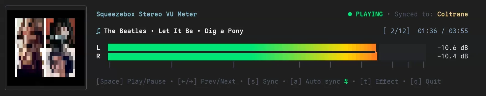

# go-slimvu

High-performance, pure Go virtual Squeezebox / Logitech Media Server (LMS) audio level provider and VU meter engine.



`go-slimvu` emulates a hardware Squeezebox player over the **SlimProto** protocol, decodes incoming audio streams in real time with high-precision sample pacing, and exposes lock-free, zero-allocation left/right stereo RMS decibel levels for LED visualizers, displays, terminal visualizers, and audio monitors.

## Features

- **SlimProto Virtual Player**: Implements full SlimProto TCP handshaking (`HELO`/`STAT`/`STRM`), metadata exchange, and time-synchronized playback.
- **Multi-Codec Audio Decoding**:
  - **FLAC** (Native streaming chunk/frame decoding via `mewkiz/flac`)
  - **MP3** (Streaming MPEG decoding via `hajimehoshi/go-mp3`)
  - **AAC / ADTS** (High-efficiency decoding via `skrashevich/go-aac`)
  - **Ogg Vorbis** (Streaming Vorbis decoding via `jfreymuth/oggvorbis`)
  - **Opus** (Ogg/Opus container decoding via `pion/opus`)
  - **PCM / Raw** (Big/Little endian, 8/16/24/32-bit linear PCM)
- **High-Precision Clock Pacing**: Micro-paused sample consumption driven by system clock jiffies to stay in sync with multi-room audio zones.
- **Zero-Allocation Level Metering**: Lock-free atomic packed integers (`AtomicLevels`) for real-time reads at 30–60+ FPS without garbage collection pressure or heap allocations.
- **LMS UDP Auto-Discovery**: Automatically locates Logitech Media Server instances on the local network (IPv4 UDP broadcast `e/E` probe).
- **Intelligent AutoSync**: Automatically queries LMS via JSON-RPC to slave the virtual VU player to any currently playing physical player in the house, following playlist changes and room migrations dynamically.
- **Rich Terminal UI (`slimvu`)**:
  - Real-time 60 FPS stereo RMS decibel meter with smooth peak-hold decay and 8× sub-pixel block resolution (`▏` through `█`).
  - Full-color album cover art thumbnail rendered via 2×2 Unicode quadrant sub-pixel clustering with automatic terminal cell aspect ratio compensation.
  - Interactive popup modal (`s`) for manual multi-room zone targeting.
  - Live metadata tracking (`Artist · Album · Title`, elapsed/total duration, track number) with marquee scrolling.

## Used By

- [**GoLEDS**](https://github.com/jtl5770/goleds) — A flexible concurrent lighting system and reactive LED strip controller that uses `go-slimvu` to drive live stereo RMS decibel visualizers and multi-room audio sync.

## Installation

```bash
go get github.com/jtl5770/go-slimvu
```

To install the `slimvu` TUI binary directly:

```bash
go install github.com/jtl5770/go-slimvu/cmd/slimvu@latest
```

## Running the Terminal UI (`slimvu`)

Launch `slimvu` to automatically discover your LMS server, synchronize to the currently playing room, and display the live stereo VU meter with album artwork:

```bash
slimvu
```

### Keyboard Controls

| Key | Action |
| --- | --- |
| `Space` | Toggle Play / Pause on active player |
| `←` / `→` | Previous / Next track |
| `s` | Open interactive popup to manually select sync target |
| `a` | Toggle AutoSync automation on/off |
| `q` / `Ctrl+C` | Quit |

### CLI Options

```
Usage of slimvu:
  -server string
        LMS server host or IP (leave empty for UDP auto-discovery)
  -port int
        SlimProto port (default 3483 / auto-discovered)
  -rpc int
        JSON-RPC port (default 9000 / auto-discovered)
  -name string
        Squeezebox virtual player name (default "SlimVU")
  -mac string
        Player MAC address (default "auto")
  -sync
        Automatically sync to active player (default true)
  -cover
        Display album cover art thumbnail (auto-detected by default)
  -cell-aspect float
        Terminal character cell aspect ratio Height/Width (0.0 for auto-detect)
  -fps int
        UI refresh rate in FPS (default 60)
  -hold int
        Peak hold time in milliseconds (default 250)
  -decay float
        Peak decay rate in blocks/sec (default 20)
  -min-db float
        Minimum decibel level for scale (default -60)
  -max-db float
        Maximum decibel level for scale (default 0)
  -log string
        File path to write debug/info logs (disabled by default)
```

## Library SDK Guide

The `go-slimvu` package exposes a clean, high-level API designed for applications, LED controllers, displays, and audio monitors.

### Quick Start

```go
package main

import (
	"fmt"
	"time"

	"github.com/jtl5770/go-slimvu"
)

func main() {
	// Configure the provider. Leave Server empty for automatic UDP discovery.
	cfg := slimvu.Config{
		Server:     "",         // Empty string triggers UDP auto-discovery
		PlayerName: "VU Meter", // Display name in LMS
		PlayerMAC:  "auto",     // Automatically generates/derives a virtual MAC
		AutoSync:   true,       // Automatically sync to active playing zones
	}

	provider, err := slimvu.NewProvider(cfg)
	if err != nil {
		panic(err)
	}

	// Start() connects to LMS, begins SlimProto streaming, and initiates discovery
	if err := provider.Start(); err != nil {
		panic(err)
	}
	defer provider.Stop()

	ticker := time.NewTicker(16 * time.Millisecond) // ~60 FPS
	defer ticker.Stop()

	for range ticker.C {
		leftDB, rightDB, isPlaying := provider.GetLevels()
		if !isPlaying {
			continue
		}

		prefix := ""
		if track, ok := provider.GetTrackInfo(); ok {
			prefix = fmt.Sprintf("[%s - %s]: ", track.Artist, track.Title)
		}

		fmt.Printf("%s%6.1f dB | %6.1f dB\n", prefix, leftDB, rightDB)
	}
}
```

### Configuration Options

```go
type Config struct {
    Server         string        // LMS hostname or IP (empty = UDP auto-discovery)
    SlimProtoPort  int           // SlimProto port (0 = auto-discover / default 3483)
    JSONRPCPort    int           // JSON-RPC port (0 = auto-discover / default 9000)
    PlayerName     string        // Name reported to LMS (default: "SlimVU")
    PlayerMAC      string        // MAC address string, or "auto"
    AutoSync       bool          // Automatically slave to active playing rooms
    IgnoredPlayers []string      // Names/MACs to exclude from AutoSync targeting
    PollInterval   time.Duration // LMS status poll interval (default: 500ms)
}
```

### Full API Reference

#### Core Lifecycle & Metering
- **`provider.Start() error`**
  Starts background workers, connects to LMS over SlimProto, and performs the initial player discovery. *Must be called prior to querying levels or player state.*
- **`provider.Stop() error`**
  Gracefully unsyncs from any active sync group, closes the SlimProto audio connection, and stops all background workers.
- **`provider.GetLevels() (leftDB, rightDB float64, playing bool)`**
  Lock-free, zero-allocation read of instantaneous stereo audio levels (in dBFS, e.g. `-100.0 dB` silence up to `0.0 dB` full-scale).

#### Player Discovery & Status
- **`provider.GetAllPlayers() []control.PlayerStatus`**
  Returns a snapshot of all external physical players currently connected to LMS (virtual SlimVU instances are automatically filtered). Automatically updates in real time when players disconnect or power down.
- **`provider.GetOurPlayer() control.PlayerStatus`**
  Returns the current status of the local virtual player.
- **`provider.GetSyncedPlayer() (mac, name string)`**
  Returns the MAC address and friendly name of the master player SlimVU is currently slaved to (or `("", "")` if standalone).
- **`provider.GetTrackInfo() (control.TrackInfo, bool)`**
  Returns metadata for the currently playing track (`Title`, `Artist`, `Album`, `Duration`, `Elapsed`, `CoverID`, `ArtworkURL`, etc.).

#### Multi-Room Zone Synchronization
- **`provider.SyncTo(target string)`**
  Manually syncs the virtual player to a specific target player (by name or MAC address).
- **`provider.Unsync()`**
  Detaches SlimVU from its current sync group.
- **`provider.SetAutoSync(enabled bool)`** / **`provider.GetAutoSync() bool`**
  Dynamically enables or disables automatic zone following.

#### Playback Controls & Media Artwork
- **`provider.Play(ctx context.Context) error`**
- **`provider.TogglePause(ctx context.Context) error`**
- **`provider.StopPlayback(ctx context.Context) error`**
- **`provider.Next(ctx context.Context) error`**
- **`provider.Previous(ctx context.Context) error`**
- **`provider.GetArtwork(ctx context.Context, artworkURL, coverID string) ([]byte, error)`**
  Fetches raw JPEG/PNG cover artwork image bytes directly from LMS.
- **`provider.GetServerInfo() (host string, slimProtoPort, jsonRPCPort int)`**
  Returns the resolved server host and network ports.

## Running Tests

```bash
go test -v -race ./...
```

## Acknowledgments

Special thanks to the [**Squeezelite**](https://github.com/ralph-irving/squeezelite) project (by Adrian Smith and Ralph Irving). The SlimProto network state machine, sample pacing calculations, and protocol implementation details in this project were inspired by and modeled after their pioneering C codebase.

## License

LGPL-3.0 License. See [COPYING.LESSER](COPYING.LESSER) and [COPYING](COPYING) for details.
